# Hexz

Deduplicated checkpoint storage for ML model weights. Pack safetensors and GGUF files into seekable `.hxz` archives that chunk at tensor boundaries and store fine-tunes as XOR deltas against their base.

**[Documentation](https://hexz-org.github.io/hexz/) · [PyPI](https://pypi.org/project/hexz/) · [crates.io](https://crates.io/crates/hexz-cli) · [Releases](https://github.com/hexz-org/hexz/releases)**

---

## Install

```bash
pip install hexz           # Python library
cargo install hexz-cli     # CLI tool
```

---

## CLI

```bash
# Pack a safetensors or GGUF model
hexz store base-model.safetensors base-model.hxz

# Store a fine-tune — delta against the base (XOR compression)
hexz store finetuned.safetensors finetuned.hxz --base base-model.hxz

# Export back to safetensors
hexz extract finetuned.hxz finetuned-out.safetensors

# Extract a single tensor
hexz extract finetuned.hxz --tensor lm_head.weight

# Inspect: format, compression, checkpoint metadata, scalars, message
hexz inspect finetuned.hxz
#   checkpoint: v1.0, 122 tensors
#   scalars:    loss=2.2702, step=8
#   message:    switched to cosine annealing lr schedule

# Compare two archives — which tensors changed
hexz diff base-model.hxz finetuned.hxz

# List archives with messages and scalars inline
hexz ls ./checkpoints/
#   └── step_00.hxz   39.61 MiB  pretrained resnet-18 base
#       └── step_01.hxz   14.04 MiB  loss=2.3993, step=1

# Sign and verify
hexz keygen
hexz sign   --key private.key finetuned.hxz
hexz verify --key public.key  finetuned.hxz
```

Run `hexz --help` or `hexz COMMAND --help` for full usage.

---

## Python API

### Import from safetensors (no PyTorch required)

```python
import hexz.checkpoint as ckpt

# Convert a safetensors file — chunks at tensor boundaries
ckpt.convert("base-model.safetensors", "base-model.hxz")

# Store a fine-tune as XOR delta — only diffs stored
ckpt.convert("finetuned.safetensors", "finetuned.hxz", base="base-model.hxz")

# Export back to safetensors
ckpt.extract("finetuned.hxz", "finetuned-out.safetensors")

# Extract a single tensor to raw bytes
ckpt.extract("finetuned.hxz", tensor="lm_head.weight")
```

### Save and load PyTorch state dicts

```python
import hexz.checkpoint as ckpt

# Save — stores XOR delta against parent
ckpt.save(model.state_dict(), "finetuned.hxz", parent="base-model.hxz",
          message="lm_head fine-tune, lr=2e-4")

# Load all tensors
state = ckpt.load("finetuned.hxz", device="cuda")

# Load only what you need — reads only those blocks from disk or S3
state = ckpt.load("finetuned.hxz", keys=["lm_head.weight", "embed_tokens.weight"])

# Inspect names and shapes without loading data
manifest = ckpt.manifest("finetuned.hxz")
```

### Random access over S3

```python
import hexz

# Only the requested blocks are downloaded
with hexz.open("s3://my-bucket/finetuned.hxz") as r:
    data = r.read(length, offset=tensor_offset)
```

---

## Storage Architecture

```mermaid
flowchart TD
    subgraph Write["Write Path"]
        SRC["safetensors / GGUF input"]
        CHUNK["Tensor-boundary chunking<br/>no rolling-hash needed —<br/>safetensors header gives exact offsets"]
        COMPRESS["LZ4 or Zstd compression<br/>per-block · independently decompressible"]
        BLAKE["BLAKE3 hash<br/>block dedup against parent chain"]
        IDX["Two-level B-tree index<br/>master index → index pages → BlockInfo"]
        HXZ[".hxz archive<br/>header · blocks · index"]
    end

    subgraph Read["Read Path (O(log P + log B))"]
        REQ["read_at(offset, length)"]
        MS["Binary search master index<br/>find page containing offset"]
        PG["Load index page (LRU cached)<br/>binary search → BlockInfo"]
        BLK["Fetch block<br/>local · HTTP range · S3 byte-range"]
        DECOMP["Decompress + return slice"]
    end

    subgraph Delta["Delta Storage (fine-tune)"]
        BASE["base.hxz<br/>all tensors stored raw"]
        FINETUNE["finetuned.hxz<br/>parent_path = base.hxz"]
        SAME["Identical tensors<br/>→ BLOCK_OFFSET_PARENT (8 bytes)"]
        DIFF["Changed tensors<br/>delta = base XOR fine<br/>byte-shuffled + zstd compressed"]
    end

    SRC --> CHUNK --> COMPRESS --> BLAKE --> IDX --> HXZ
    REQ --> MS --> PG --> BLK --> DECOMP
    BASE --> SAME --> FINETUNE
    BASE --> DIFF --> FINETUNE
```



---

## How delta storage works

When you pass `--base base.hxz` (CLI) or `base=` (Python):

1. The safetensors header tells Hexz exactly where each tensor lives — no CDC rolling-hash scan needed
2. For each tensor present in both files: `delta = base_tensor XOR fine_tensor`
3. Fine-tuning perturbs weights across all layers without inserting or deleting bytes, so `delta` is dense but low-magnitude — zstd handles this well
4. Tensors with no parent match (new adapter layers) are stored as-is
5. Tensors byte-identical to the parent cost zero extra bytes via BLAKE3 block dedup

On load, Hexz reads the base tensor, decompresses the XOR delta, and XORs again to reconstruct. This is transparent to `ckpt.load()`.

> **Note:** XOR delta compression ratios on real model fine-tunes have not yet been benchmarked. The theoretical basis (ZipLLM, Hachiuma et al.) predicts significant savings; empirical numbers will be added once Phase 3 is complete. See [ROADMAP.md](docs/project-docs/ROADMAP.md).

---

## License

Licensed under [Apache 2.0](LICENSE-APACHE) or [MIT](LICENSE-MIT), at your option.
