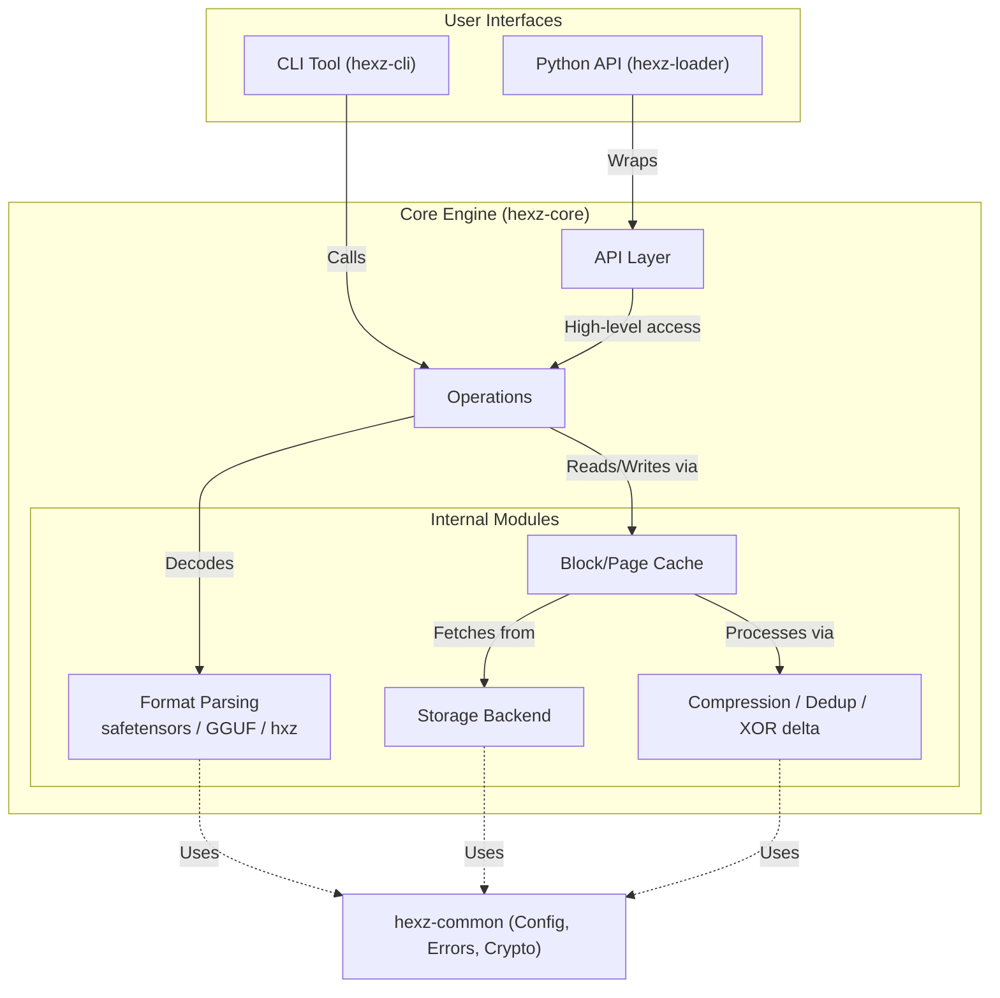
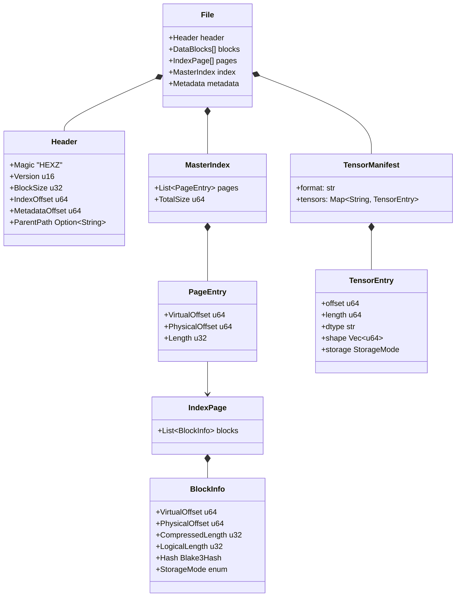
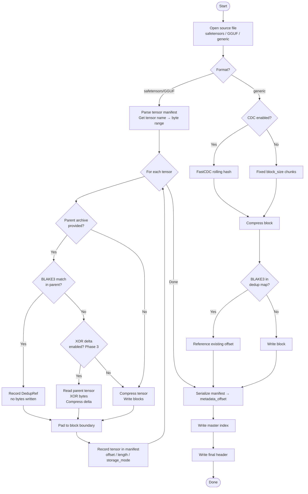
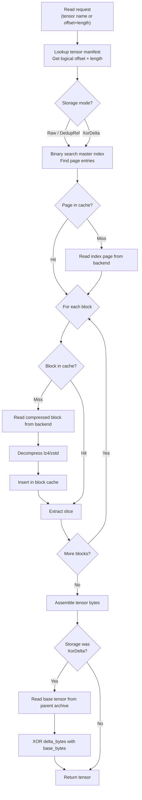

# Hexz Architecture

This document covers the internal architecture of Hexz: format structure, read/write paths, deduplication, tensor manifest, and tensor-level chunking. The FUSE overlay (copy-on-write VM disk layer) is not covered here — that use case is deprioritized. See [ROADMAP.md](../project-docs/ROADMAP.md).

## System Overview



## File Format Structure

The `.hxz` file is a binary format designed for O(log N) random access. A fixed-size header points to a master index, which maps virtual offsets to page indices, which contain metadata for individual data blocks. An optional tensor manifest is stored at `metadata_offset` in the header.



### Storage modes

`BlockInfo.StorageMode` (and `TensorEntry.storage`) encodes how a block was stored:

| Mode | Description |
|---|---|
| `Raw` | Block stored as-is (compressed with lz4/zstd) |
| `DedupRef` | Block content is identical to a block at `physical_offset` (may be in parent) |
| `Zero` | Block is all zeros — stored as 8 bytes of metadata, no data |
| `XorDelta` | Block is the XOR delta of this tensor against the parent's tensor (Phase 3) |

## Tensor Manifest

When packing a safetensors or GGUF file, Hexz writes a tensor manifest into the `metadata_offset` slot in the header. The manifest is a msgpack blob with this schema:

```json
{
  "format": "safetensors",
  "version": "1",
  "safetensors_header": "<original safetensors JSON header>",
  "tensors": {
    "embed_tokens.weight": {
      "offset": 0,
      "length": 268435456,
      "dtype": "BF16",
      "shape": [32000, 4096],
      "storage": "raw"
    },
    "lm_head.weight": {
      "offset": 268500992,
      "length": 268435456,
      "dtype": "BF16",
      "shape": [32000, 4096],
      "storage": "xor_delta"
    }
  }
}
```

`offset` and `length` are the logical byte range in the archive's virtual address space. The storage backend resolves logical offsets to physical block locations via the master index.

## Tensor-Level Chunking

For safetensors and GGUF files, Hexz does not use CDC (content-defined chunking). Instead:

1. Parse the file header to get a sorted list of `(tensor_name, data_start, data_end)`.
2. For each tensor, write its bytes in fixed `block_size` chunks. After the last chunk, pad to the next `block_size` boundary with zeros.
3. Record the logical offset and length of each tensor in the manifest.

This is simpler than CDC and avoids the rolling-hash scan overhead. Tensor boundaries never shift between a base model and a fine-tune (same architecture = same shapes), so tensor-boundary chunking provides stable block identities for dedup.

## Write Path (packing)



## Read Path



## Deduplication Logic

During packing, Hexz maintains an in-memory BLAKE3 hash → physical offset map. When a compressed block's hash matches an existing entry, the index records the existing physical offset and no bytes are written. For parent-chain dedup, the parent archive's index is loaded at pack time and blocks in the parent are added to the dedup map with their parent-relative offsets.

At read time, if a block's `physical_offset` refers to the parent archive, the storage backend transparently opens the parent file and reads from it.

## Storage Backends

The storage backend abstraction (`hexz-core::store`) provides byte-range reads from:

- `FileBackend` — local disk, using `pread` for concurrent access
- `MmapBackend` — memory-mapped file for zero-copy reads on warm pages
- `HttpBackend` — HTTP byte-range requests (`Range: bytes=start-end`)
- `S3Backend` — AWS S3 byte-range requests

All backends implement `read_at(offset: u64, length: u64) -> Bytes`. The caller does not need to know which backend is in use.
