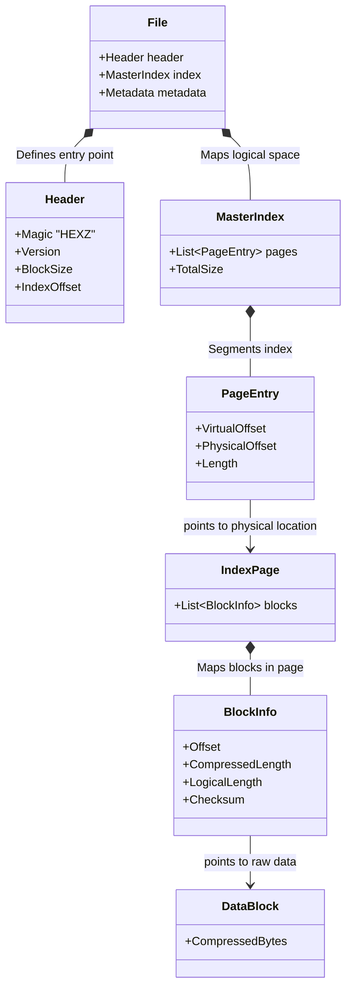
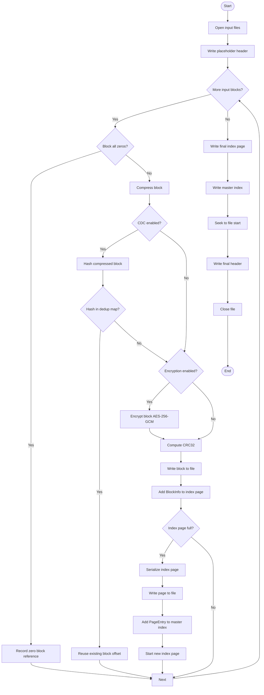
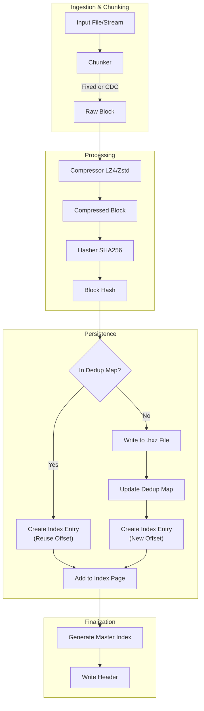
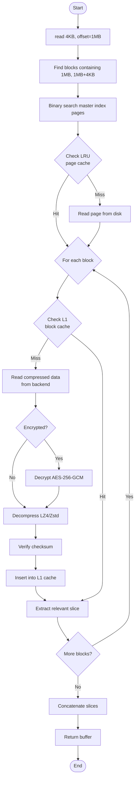
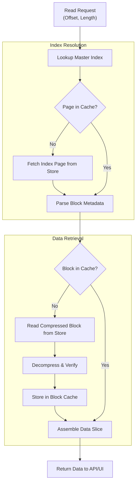
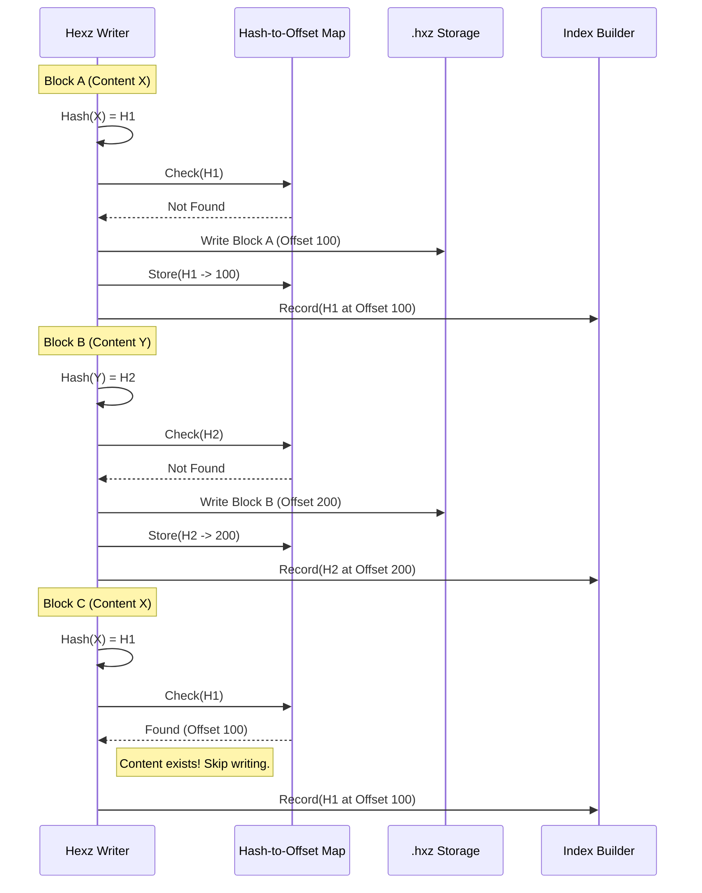
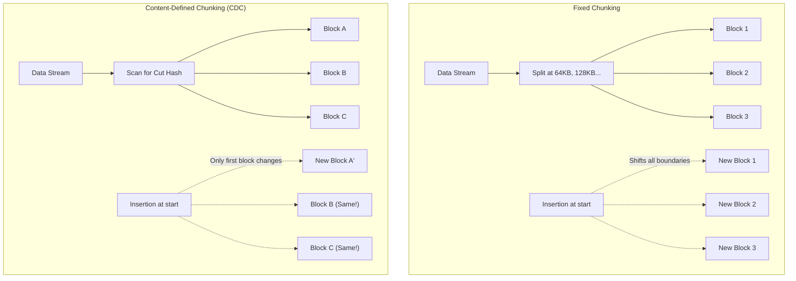
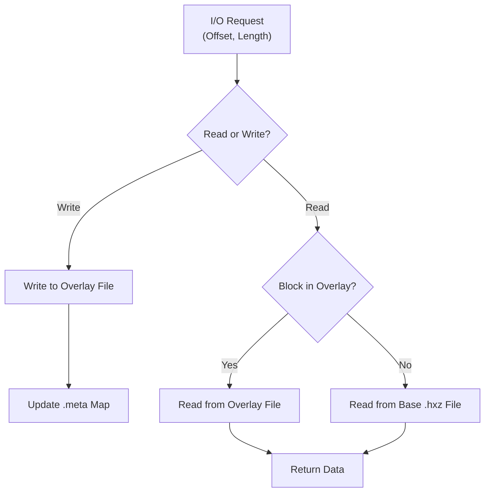

# Hexz Data Flow and Architecture

This document details the internal architecture and data flow of the Hexz project, illustrating how various components interact to provide high-performance seekable access to compressed data.

## System Architecture

Hexz is built as a modular ecosystem. The user interacts through the CLI, Python API, or FUSE mount, all of which depend on the `hexz-core` engine. This engine orchestrates low-level modules like storage backends, compression algorithms, and caching layers, while `hexz-common` provides shared utilities.

```mermaid
graph TD
    subgraph "User Interfaces"
        CLI["CLI Tool<br/>(hexz-cli)"]
        Py["Python API<br/>(hexz-loader)"]
        Fuse["FUSE Mount<br/>(hexz-fuse)"]
    end

    subgraph "Core Engine (hexz-core)"
        API[API Layer]
        Ops[Operations]
        
        subgraph "Internal Modules"
            Format[Format Parsing]
            Cache[Block/Page Cache]
            Algo[Compression/Dedup]
            Store[Storage Backend]
        end
    end

    Common["hexz-common<br/>(Config, Errors, Crypto)"]

    CLI -->|Calls| Ops
    Py -->|Wraps| API
    Fuse -->|Mounts via| API

    API -->|High-level access| Ops
    Ops -->|Decodes| Format
    Ops -->|Reads/Writes via| Cache
    
    Cache -->|Fetches from| Store
    Cache -->|Processes via| Algo
    
    Format -.->|Uses| Common
    Store -.->|Uses| Common
    Algo -.->|Uses| Common
```

## File Format Structure

The Hexz (`.hxz`) file is a structured binary format designed for random access. It starts with a fixed-size header pointing to a Master Index. This index maps virtual offsets to Page Indices, which in turn contain metadata for individual compressed data blocks. This hierarchical lookup allows the engine to find any byte in the file with minimal I/O.

## Write Path (Packing)

During the packing process, input data is streamed and broken into chunks (fixed-size or content-defined). Each chunk is compressed and hashed. The system checks a deduplication map to see if the content already exists; if so, it references the existing offset. Otherwise, it writes the new block and updates the index. Finally, it writes the master index and updates the file header.

### Detailed Write Flow

## Read Path

When a read request is made for a specific offset and length, the engine first consults the Master Index to find the relevant Index Pages. These pages are loaded (and cached) to identify the specific blocks containing the requested data. The engine then checks the block cache; on a miss, it fetches the compressed data from the storage backend, decompresses it, and serves the requested slice to the user.

### Detailed Read Flow

## Deduplication Logic

Deduplication occurs during the write path and is transparent to the reader. By hashing compressed blocks and maintaining a mapping of hashes to file offsets, Hexz ensures that identical content is only stored once. Multiple index entries can point to the same physical data block, significantly reducing storage requirements for redundant data like OS images or repetitive logs.

## Chunking Strategy (Fixed vs. CDC)

Hexz supports both fixed-size chunking and Content-Defined Chunking (CDC). Fixed chunking splits data at regular intervals (e.g., every 64KB), while CDC uses a rolling hash to find "cut points" based on the data's content. CDC is superior for deduplication because small insertions shift boundaries in fixed chunking (breaking all subsequent blocks), whereas CDC resynchronizes, preserving matching blocks.

## FUSE Overlay (Copy-On-Write)

When a Hexz archive is mounted with `--overlay`, it presents a writable filesystem. Since the `.hxz` file is immutable, writes are redirected to a temporary overlay file. A metadata map tracks which 4KB blocks have been modified. Read requests first check this map; if the block is modified, it is read from the overlay; otherwise, it is fetched from the base `.hxz` file.

