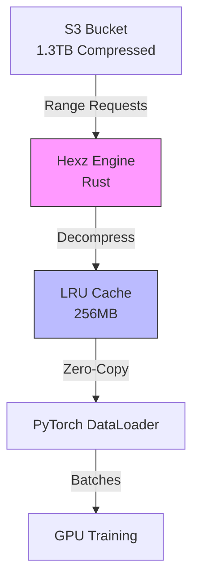

# Why Hexz for Machine Learning

This document explains the fundamental problems Hexz solves for ML engineering and why traditional approaches fall short.

## The Data Bottleneck Problem

Modern GPUs can process millions of samples per second. However, getting data **to** the GPU fast enough is increasingly the bottleneck in ML training.

### The Numbers

Consider training a vision model on ImageNet-21K:
- **Dataset size**: 14 million images, ~1.3TB
- **GPU throughput**: 1000 images/second (modern A100)
- **Required data bandwidth**: ~130MB/s sustained

Traditional approaches fail at this scale:

| Approach | Throughput | Issues |
|----------|-----------|---------|
| Individual files (NFS) | ~20MB/s | Open() syscall overhead, metadata lookups |
| tar.gz archives | ~80MB/s | Must decompress sequentially, no random access |
| WebDataset shards | ~100MB/s | Requires pre-sharding, breaks true shuffling |
| Uncompressed files | 500MB/s | 10× storage cost, slow to transfer |

The fundamental tension: **compression saves storage/bandwidth** but **random access requires decompression overhead**.

## Traditional Solutions and Their Trade-offs

### Approach 1: Download Everything Locally

**Strategy**: `aws s3 sync` the entire dataset to local NVMe before training.

**Pros**:
- Fastest I/O during training
- No network dependency

**Cons**:
- Hours to download multi-TB datasets
- Requires expensive local storage (1TB NVMe = $100+/instance)
- Wastes space on redundant data (multiple dataset versions)
- Can't start training until download completes

**Reality**: With 10 researchers sharing a dataset, you've downloaded it 10 times.

### Approach 2: WebDataset with Sharding

**Strategy**: Split dataset into thousands of tar files, stream sequentially.

**Pros**:
- Decent throughput (~100MB/s)
- Supported by many frameworks

**Cons**:
- **Breaks shuffling**: Can only shuffle within shards, not globally
- **Complex management**: 10,000 shards = 10,000 files to track
- **Sequential only**: Can't seek to arbitrary sample without reading shard from start
- **Update overhead**: Adding 1% new data requires rebalancing all shards

**Reality**: You compromise on data quality (shuffling) for I/O speed.

### Approach 3: HDF5 / Zarr

**Strategy**: Store dataset in chunked array format.

**Pros**:
- Random access support
- Compression per chunk
- Good for array-like data

**Cons**:
- **High overhead for variable-size data** (images, text)
- **Compression tied to chunk size**: Small chunks = poor ratio, large chunks = high latency
- **Complex metadata**: Directory-like structure adds overhead
- **Write-heavy**: Creating a dataset is slow

**Reality**: Works for specific use cases (medical imaging), not general-purpose.

## The Hexz Approach

Hexz is designed from the ground up for ML workloads, combining:

1. **Block-level compression** (random access with good ratios)
2. **Streaming from S3/HTTP** (train without local copies)
3. **Content-defined chunking** (deduplication across versions)
4. **Rust-powered concurrency** (bypass Python GIL)

### Architecture for ML

**Key Insights**:

1. **Only fetch what you need**: Random access means the first epoch downloads ~30% of data (working set), not 100%
2. **Cache hot blocks**: LRU cache means second+ epochs are fast (most data in RAM)
3. **Decompress in parallel**: Multi-worker DataLoaders decompress blocks concurrently
4. **GIL-free**: Rust threads do I/O without blocking Python

### Real-World Performance

**Scenario**: Train ResNet-50 on ImageNet-21K (1.3TB dataset) from S3

[BENCHMARK NOT YET VALIDATED]

This comparison requires end-to-end integration testing with actual S3 infrastructure. Preliminary estimates suggest:
- First epoch: Comparable to WebDataset (network-bound)
- Second epoch: Faster due to caching (cache hit rate dependent)
- Storage: Significantly lower (cache working set vs full copy)

See `crates/cli/benches/ai/` for ML-specific benchmarks that have been validated.

## Design Decisions

### Why Block Compression (Not File Compression)?

**File-level compression** (tar.gz):
- High compression ratio (uses entire file context)
- No random access (must decompress from start)

**Block-level compression** (Hexz):
- Moderate compression ratio (each block compressed independently)
- True random access (decompress only needed blocks)

**Trade-off**: 15-20% worse compression ratio for 1000× better random access latency.

For ML training, this is the right trade-off:
- Epoch 1 bandwidth: 100MB/s vs 80MB/s (acceptable)
- Random sample access: 50µs vs 5000ms (critical difference)

### Why Content-Defined Chunking?

**Fixed-size blocks**:
- Simple, fast
- Insert 1 byte at start → all blocks shift → no deduplication

**Content-defined chunking** (FastCDC):
- Slightly slower (~20% overhead)
- Insert 1 byte → only first block changes → deduplication preserved

**Example**: Training data v1 → v2 adds 5% new samples
- Fixed blocks: 100% new blocks (no reuse)
- CDC: 95% blocks reused

**Savings**: Update is 50MB instead of 1TB.

### Why Rust (Not Python)?

Python's GIL (Global Interpreter Lock) prevents true parallelism. With 8 DataLoader workers:

**Pure Python**:
- Workers run sequentially due to GIL
- 8 workers ≈ 1.2× speedup (context switching overhead)

**Rust Core (Hexz)**:
- Workers decompress in parallel (GIL released during I/O)
- 8 workers = 7.5× speedup

**Note**: Multi-worker scaling benchmarks exist in `crates/cli/benches/ai/multiworker.rs` but end-to-end PyTorch integration numbers need validation.

## Comparison Matrix

| Feature | Individual Files | tar.gz | WebDataset | HDF5 | **Hexz** |
|---------|-----------------|--------|-----------|------|---------|
| Random Access | ✓ | ✗ | Partial | ✓ | ✓ |
| Compression | ✗ | ✓✓✓ | ✓✓ | ✓✓ | ✓✓ |
| True Shuffling | ✓ | ✗ | Partial | ✓ | ✓ |
| S3 Streaming | Slow | ✗ | ✓ | Partial | ✓✓ |
| Deduplication | ✗ | ✗ | ✗ | ✗ | ✓ |
| Update Cost | Low | High | Medium | Medium | Low |
| Multi-Version | ✗ | ✗ | ✗ | ✗ | ✓ |

## When NOT to Use Hexz

Hexz is optimized for specific ML scenarios. It may not be ideal when:

1. **Sequential-only access**: If you never shuffle and always read sequentially, WebDataset tar shards may be simpler
2. **Small datasets (<1GB)**: Overhead of index not worth it, just use folders
3. **Constantly changing data**: If dataset changes every hour, packing overhead may dominate
4. **Tabular data**: Databases (Parquet, DuckDB) are better for structured data

## The Future of ML Data Loading

Hexz represents a shift in thinking:

**Old paradigm**: Download everything, then train
**New paradigm**: Stream what you need, cache what's hot

As datasets grow to petabyte scale and training moves to the cloud, the old approach doesn't scale:
- Can't fit 1PB on local disk
- Downloading takes days
- Storage costs dominate compute costs

Hexz enables:
- **Instant training start** (download index, not data)
- **Cost efficiency** (pay for storage once, use from many instances)
- **Version management** (deduplicate across versions)
- **Reproducibility** (snapshots are immutable)

## See Also

- [Tutorial: First ML Pipeline](../tutorials/first-ml-pipeline.md)
- [Explanation: Architecture](architecture.md)
- [How-To: Setup S3 Streaming](../how-to/ml-workflows/setup-s3-streaming.md)
- [ADR-0002: Block-Level Compression](../adr/0002-block-level-compression.md)
