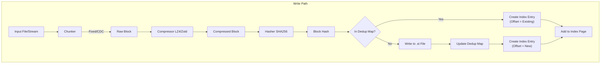
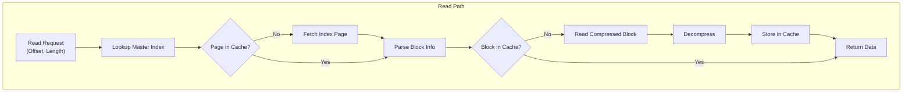

# Strata Data Flow and Architecture

This document details the internal architecture and data flow of the Strata project.

## System Overview

Strata is a high-performance streaming engine designed to allow seekable access to compressed, deduplicated data. It bridges the gap between static storage (S3, Disk) and dynamic compute (GPUs, VMs) by using a specialized file format (`.st`) and a Rust-based engine.

### Key Components

1.  **`crates/core`**: The engine's heart.
    *   **`format`**: Defines the on-disk binary format (headers, indices, blocks).
    *   **`store`**: Abstracts storage backends (File, S3, HTTP).
    *   **`algo`**: Implements compression (LZ4, Zstd), hashing (BLAKE3, SHA256), and deduplication.
    *   **`api`**: Exposes `StrataFile` for reading.
2.  **`crates/loader`**: Python bindings.
    *   Uses `pyo3` to expose `core` functionality to Python.
    *   `StrataBuilder` (Rust) -> `strata.Writer` (Python) for creating archives.
    *   `StrataReader` (Rust) -> `StrataLoader` (Python) for reading.
3.  **`crates/cli`**: Command-line interface.
    *   Wraps `core` and `loader` logic for `pack`, `boot`, `mount` operations.
4.  **`crates/fuse`**: Filesystem in Userspace.
    *   Allows mounting `.st` files as read-only filesystems.

## Data Flow: Write Path (Packing)

When a user runs `strata pack` or uses `strata.Writer`, the following process occurs:

### 1. Input Processing
Data is ingested from a source (local directory, raw disk image, or memory buffer).
*   **Source**: Files are read sequentially.
*   **Abstraction**: `crates/loader/src/py_interface/builder.rs` handles the input stream.

### 2. Chunking
The input stream is broken into chunks.
*   **Fixed Chunking**: Stream is split into fixed-size blocks (e.g., 64KB).
*   **CDC (Content-Defined Chunking)**: If enabled, `FastCDC` scans the stream for cut points based on content hash, creating variable-sized chunks. This improves deduplication alignment.

### 3. Processing (Compression & Hashing)
Each chunk is processed independently:
1.  **Compression**: The chunk is compressed using the selected algorithm (LZ4 or Zstd).
2.  **Hashing**:
    *   **Integrity**: CRC32 is calculated for the *compressed* data.
    *   **Deduplication**: SHA256 is calculated for the *compressed* data to identify duplicates.

### 4. Deduplication
The `StrataBuilder` maintains an in-memory map (`dedup_map`) of `{hash: offset}`.
*   **Check**: If the hash exists in the map, the chunk is **not written**. The index entry simply points to the existing `offset`.
*   **Write**: If the hash is new, the compressed chunk is written to the `.st` file, and its new offset is recorded in the map.

### 5. Indexing
As chunks are processed, `BlockInfo` entries are accumulated into `IndexPage`s.
*   **Structure**: `[Offset, Length, LogicalLength, Checksum]`
*   **Serialization**: Full `IndexPage`s are serialized (bincode) and written to the file.

### 6. Finalization
When the stream ends:
1.  **Master Index**: A `MasterIndex` maps logical file ranges to `IndexPage` locations. This is serialized and written.
2.  **Metadata**: Custom user metadata (JSON) is written.
3.  **Header**: The `StrataHeader` is updated at the beginning of the file (seek 0) to point to the Master Index and Metadata.

## Data Flow: Read Path

When a user reads data via `strata.open()` or PyTorch `DataLoader`:

### 1. Initialization
`StrataFile` opens the backend (e.g., S3 URL).
*   **Header**: Reads the first 512 bytes to validate magic bytes and find the Master Index offset.
*   **Master Index**: Reads and deserializes the Master Index to memory.

### 2. Seek & Lookup
When a read for logical offset `X` and length `L` is requested:
1.  **Page Lookup**: The Master Index is binary-searched to find the `IndexPage`(s) covering the range.
2.  **Page Load**: If the `IndexPage` is not in the LRU cache, it is fetched from storage and deserialized.
3.  **Block Identification**: The `IndexPage` is scanned to find the specific blocks covering `X` to `X+L`.

### 3. Fetch & Decompress
For each required block:
1.  **Cache Check**: The `BlockCache` is checked for the decompressed block.
2.  **Fetch**: If missing, the backend reads the compressed bytes from the `offset` and `length` specified in the index.
3.  **Decompress**: The block is decompressed (LZ4/Zstd) and verified against its checksum.
4.  **Store**: The decompressed block is stored in the `BlockCache`.

### 4. Assembly
The relevant slices of the decompressed blocks are copied into the destination buffer (e.g., a NumPy array or PyTorch tensor).

## Deduplication Logic

Deduplication works at the **block level**.
*   **Scope**: Currently local to a single `.st` file (including its overlays/parents).
*   **Mechanism**:
    *   **Writer**: Maintains `HashMap<Hash, FileOffset>`.
    *   **Reader**: Agnostic to deduplication. It simply follows the `offset` in the index. If two index entries point to the same offset, they share the data.

## API & Commands

### CLI (`strata`)
*   `pack`: Drives the Write Path.
*   `boot`: Uses `crates/fuse` or direct KVM integration to map the Read Path to a virtual block device.

### Python API
*   `strata.Writer`: Wraps `StrataBuilder`.
    *   `.add(file)`: Streams file through the Write Path.
    *   `.finalize()`: Writes footer/header.
*   `strata.StrataLoader` (Reader): Wraps `StrataFile`.
    *   `__getitem__`: Triggers the Read Path for specific samples.

## Data Flow Diagram

### Write Path

### Read Path

