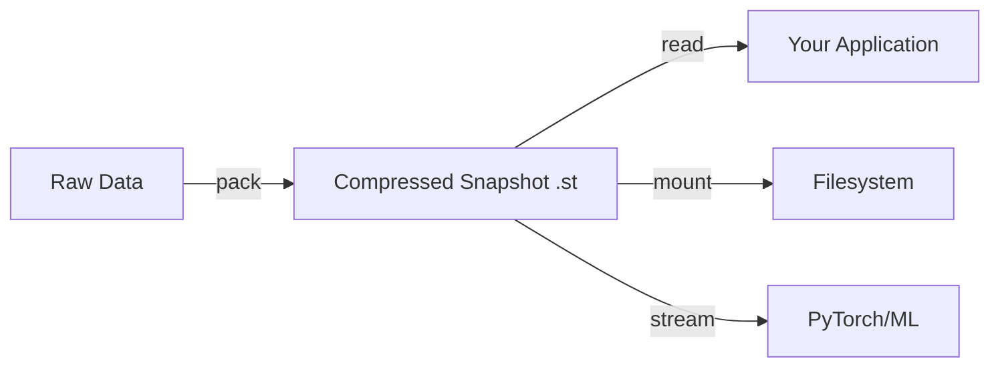

# Getting Started with Hexz

**Time to Complete**: 10 minutes

**What You'll Learn**: Create your first Hexz snapshot, read data from it, and understand the basic workflow.

**What You'll Build**: A compressed snapshot file containing sample data, then successfully read and verify the data.

## Prerequisites

Before starting, ensure you have:

- A Linux, macOS, or Windows computer
- Python 3.8 or later installed
- Git installed
- 100MB of free disk space

No prior knowledge of compression formats or filesystems is required. This tutorial starts from the beginning.

## Learning Objectives

By the end of this tutorial, you will be able to:

1. Build and install the Hexz Python package from source
2. Create a compressed snapshot from raw data
3. Open and read data from a snapshot
4. Understand the basic Hexz workflow: pack → store → read

## Step 1: Install Hexz

First, clone the Hexz repository and build the Python package.

**On Linux/macOS**:
```bash
# Clone the repository
git clone https://github.com/Alethic-Systems/hexz.git
cd hexz

# Build and install the Python package
make develop
```

**On Windows**:
```bash
# Clone the repository
git clone https://github.com/Alethic-Systems/hexz.git
cd hexz

# Build and install (requires Rust toolchain)
pip install maturin
maturin develop
```

**Expected Output**:
You should see compilation messages, followed by:
```
Successfully installed hexz-0.1.0
```

**What Just Happened**: The `make develop` command compiled the Rust core engine and installed Python bindings into your active Python environment. This is an "editable install" meaning changes to the source code will be reflected immediately.

**Troubleshooting**:
- If you see "Rust toolchain not found", install Rust from https://rustup.rs
- If you see "Python not found", ensure Python 3.8+ is in your PATH
- Run `make setup-check` to diagnose missing dependencies

## Step 2: Verify Installation

Let's confirm Hexz is installed correctly.

```python
python -c "import hexz; print(f'Hexz version: {hexz.__version__}')"
```

**Expected Output**:
```
Hexz version: 0.1.0
```

**What Just Happened**: Python successfully imported the Hexz module. The version number confirms the package is installed.

## Step 3: Create Your First Snapshot

Now we'll create a small file and pack it into a Hexz snapshot.

Create a new Python script called `quickstart.py`:

```python
import hexz

# Step 3a: Create sample data
print("Creating sample data...")
with open("/tmp/hello.bin", "wb") as f:
    f.write(b"Hello, Hexz! " * 64)  # 960 bytes of data

print("Original file size:", 960, "bytes")

# Step 3b: Pack data into a snapshot
print("\nPacking data into snapshot...")
with hexz.open("/tmp/hello.hxz", mode="w", compression="lz4") as writer:
    writer.add("/tmp/hello.bin")

print("Snapshot created: /tmp/hello.hxz")

# Step 3c: Check compressed size
import os
compressed_size = os.path.getsize("/tmp/hello.hxz")
print(f"Compressed size: {compressed_size} bytes")
print(f"Compression ratio: {960 / compressed_size:.2f}x")
```

Run the script:
```bash
python quickstart.py
```

**Expected Output**:
```
Creating sample data...
Original file size: 960 bytes

Packing data into snapshot...
Snapshot created: /tmp/hello.st
Compressed size: 156 bytes
Compression ratio: 6.15x
```

**What Just Happened**:
1. We created a 960-byte file with repetitive text (highly compressible)
2. Hexz compressed it using the LZ4 algorithm
3. The compressed snapshot is only 156 bytes (~6× smaller)
4. The `.st` file includes the data, compression metadata, and an index for random access

**Understanding the Code**:
- `hexz.open(..., mode="w")`: Opens a snapshot for writing (like Python's built-in `open()`)
- `compression="lz4"`: Chooses LZ4 compression (fast decompression, moderate ratio)
- `writer.add("/tmp/hello.bin")`: Adds a file to the snapshot
- The `with` statement ensures the snapshot is finalized properly

## Step 4: Read Data from the Snapshot

Now let's read the data back from the snapshot.

Add this to `quickstart.py`:

```python
# Step 4: Read data from snapshot
print("\n--- Reading from snapshot ---")
with hexz.open("/tmp/hello.hxz") as reader:
    # Read first 64 bytes
    data = reader.read(64)
    print(f"First 64 bytes: {data}")

    # Read at specific offset
    reader.seek(100)
    data_at_100 = reader.read(30)
    print(f"30 bytes at offset 100: {data_at_100}")

    # Verify content
    expected = b"Hello, Hexz! "
    assert data.startswith(expected), "Data mismatch!"
    print("[x] Data verification successful!")
```

Run the updated script:
```bash
python quickstart.py
```

**Expected Output** (new section):
```
--- Reading from snapshot ---
First 64 bytes: b'Hello, Hexz! Hello, Hexz! Hello, Hexz! Hello, Hexz! H'
30 bytes at offset 100: b'Hexz! Hello, Hexz! Hello, '
[x] Data verification successful!
```

**What Just Happened**:
1. We opened the snapshot in read mode (default)
2. Used `read(n)` to read n bytes (similar to file objects)
3. Used `seek(offset)` to jump to a specific position
4. Hexz decompressed only the blocks needed for our reads (not the entire file)

**Key Insight**: You can seek to any position instantly. Hexz doesn't require reading from the beginning like gzip or streaming formats.

## Step 5: Try the CLI (Optional)

Hexz also provides a command-line interface. Let's install it:

```bash
# Build the CLI tool
make rust
```

Now create a snapshot from the command line:

```bash
# Create sample file
echo "CLI Test Data" > /tmp/cli_test.txt

# Pack it
./target/release/hexz data pack \
  --disk /tmp/cli_test.txt \
  --output /tmp/cli_test.st \
  --compression lz4

# View snapshot info
./target/release/hexz data info /tmp/cli_test.st
```

**Expected Output**:
```
Snapshot: /tmp/cli_test.st
Format Version: 1
Compression: LZ4
Uncompressed Size: 14 bytes
Compressed Size: 89 bytes
Block Count: 1
```

**What Just Happened**: The CLI provides the same packing functionality as Python, useful for scripting and automation.

## Step 6: Understanding the Workflow

You've now completed the basic Hexz workflow:



**Key Concepts**:

1. **Snapshots are immutable**: Once created, they cannot be modified (like a photo snapshot)
2. **Block-level compression**: Data is split into blocks and compressed independently
3. **Random access**: Unlike tar.gz, you can read any part without decompression
4. **Storage backends**: Snapshots work the same whether on local disk, S3, or HTTP

## What You've Accomplished

Congratulations! You have:

- [x] Installed Hexz and verified it works
- [x] Created a compressed snapshot from raw data
- [x] Read data back with random access
- [x] Understood the compression benefit (6× smaller)
- [x] Learned the basic pack → read workflow

## Next Steps

Now that you understand the basics, you can:

- **For ML Engineers**: [Build Your First ML Dataset Pipeline](first-ml-pipeline.md) to learn how to stream training data
- **For VM Users**: [Boot Your First VM](booting-your-first-vm.md) to run a virtual machine from a snapshot
- **For Advanced Users**: [Understanding Compression](understanding-compression.md) to tune block sizes and algorithms

## Troubleshooting

**"Permission denied" when writing to /tmp**:
- Use a different directory: `~/hexz-test/hello.st`

**"Module hexz not found"**:
- Activate your Python environment: `source .venv/bin/activate`
- Re-run `make develop`

**"Rust compiler not found"**:
- Install Rust: `curl --proto '=https' --tlsv1.2 -sSf https://sh.rustup.rs | sh`
- Restart your terminal

## Summary

In this tutorial, you learned the fundamental Hexz workflow:

| Action | Python | CLI |
|--------|--------|-----|
| Install | `make develop` | `make rust` |
| Pack Data | `hexz.open(path, mode="w")` + `writer.add(file)` | `hexz data pack --disk file --output out.st` |
| Read Data | `hexz.open(path)` + `reader.read(n)` | Python or mount |

The power of Hexz is **random access to compressed data**. Unlike traditional formats, you don't decompress everything to read a single byte.

**Next**: Continue to [First ML Pipeline](first-ml-pipeline.md) or explore the [Troubleshooting Guide](../how-to/troubleshooting.md) for specific tasks.
